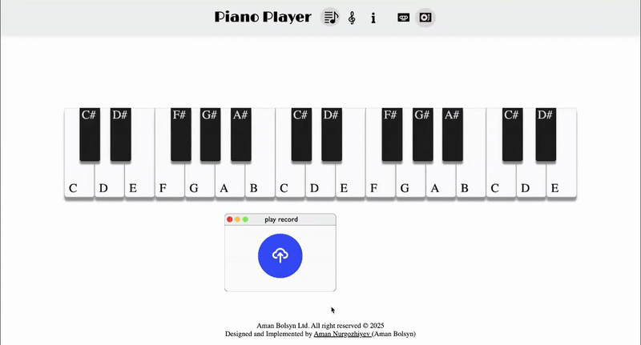
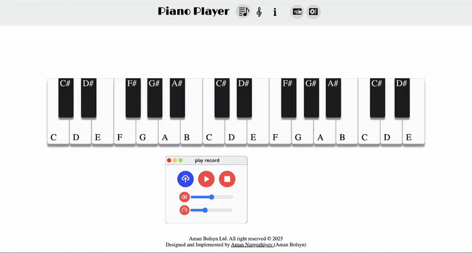

# Piano Player

Browser application called [piano-player (live-preview)](https://amanbolsyn.github.io/piano-player/main.html) is capable of: 

+ interact with the piano without recording 
+ recording songs and exporting them in a json format
+ playing pre-recroded songs by improting exported json files
+ includes playback features such as stop, pause, dynamic volume adjustment, and speed control
+ seperate draggable windows such as information, sheet tables, piano modes provide extra info and features
+ responsive designs for different size screens such as horizontal and vertical views on mobile phones


## Record mode


## Play mode

## Installation

Open up your terminal and run this command 
```bash
git clone https://github.com/amanbolsyn/piano-player.git
```

After cloning is finished run this command
```bash
cd piano-player/
```

There to ways of running task-planner locally
1. Running it using Live Server(VS code extension)
2. Or run this command on your terminal instead

```bash
python3 -m http.server 8000
```

Live server will open up the browser window automatically. The second way will provide you the link on your terminal that you have to follow. Unfortunately, the application doesn't work on Safari(working on it). 

Congratulations you installed my application. Hopefully you will be able to enjoy it. 

## Possible improvements 

+ adding backend 
+ styling range sliders for volume and speed controls
+ adding mute to volume button 
+ display speed amount when slidering 
+ adding accessibility features

## Bugs/Needs to be done

+ remove Drop and Drag events on mobile 
+ when dragging on safari wrong window container clone appers instead of correct one
+ optimize and organize js functions
+ organize styles
+ orgonize responsive styles 
+ add comments 


## Resources 

+ [SVG files](https://www.svgrepo.com)
+ [JS documenation](https://developer.mozilla.org/en-US/docs/Web/JavaScript)
+ [Project by Alem School](https://alem.school)
+ [Project requirenments](https://github.com/alem-platform/frontend/tree/main/piano-player)

## Contributing

Pull requests are welcome. For major changes, please open an issue first
to discuss what you would like to change.

## License

Cannot be used for commercial purposes.